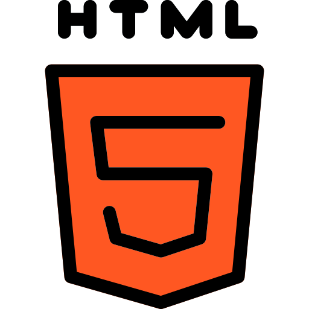

<h2 align='center'>
  <samp>
    <strong>Hi🤙🏿, I'm Blacky (Hamidou TESSILIMI)</strong>
  </samp>
</h2>

---

---

  <i>

I'm **passionate** about **programming** and **computer science** in general.
I love ***learning***, ***teaching***, ***discovering*** things in ***computer science*** to be able to contribute to ***projects*** with a possible impact on the ***population***

  </i>

---

- 🎓 I'm currently a 4th year student at [Epitech](https://epitech.bj)
- 👨🏾‍💻 I'm a backend developer using NodeJs and Python
- 💫 I'm also a [Microsoft Student Learn Ambassador](https://studentambassadors.microsoft.com/) and [Postman Student Leader](https://www.postman.com/company/student-program/) (I really like everything about Community)
- 📸 I’m looking to collaborate on everything about [photography](https://www.hamidoutessilimi.me/model)
- ⚡ Fun fact: I am very organized
- 📫 How to reach me: **tessilimi.hamidou@gmail.com**, [Twitter](https://www.twitter.com/blacky_yg) or [Instagram](https://www.instagram.com/blacky_yg)

---

<i><b>Programming Languages I know and already use</b></i>
    
  &nbsp;
  &nbsp;
  &nbsp;
  &nbsp;
  &nbsp;
  &nbsp;

<i><b>Frontend, Mobile, Database</b></i>
    
  &nbsp;
  &nbsp;
  
  &nbsp;
  
  
  
  
  

---

  

---

  

<h2 align='center'>

<h3 align="center">

📝 &nbsp; ***Feel free to contact me. I'm always here ...*** 

</h3>

